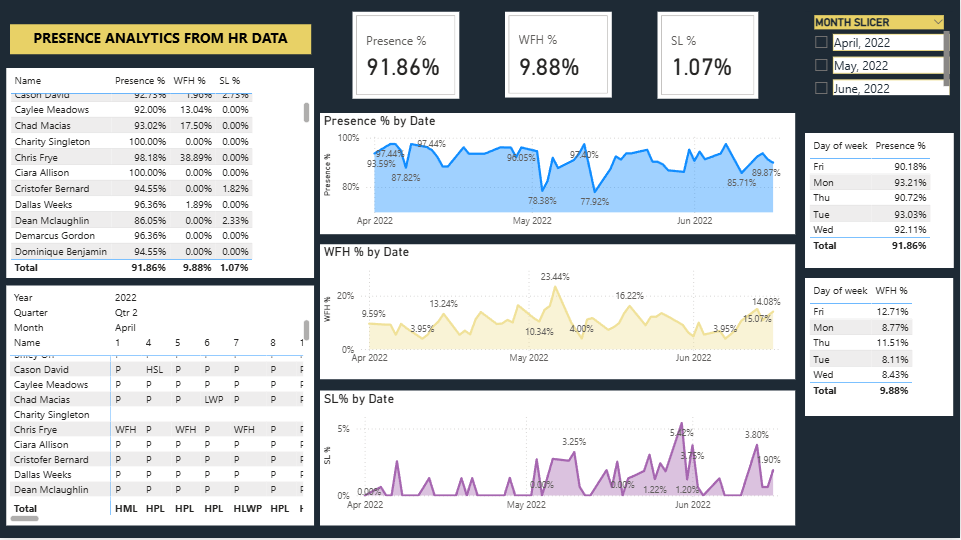

# HR-analytics-Dashboard

A Power BI dashboard built to analyze employee attendance patterns across April–June 2022.

## What it shows
- Overall **Presence %**, **Work From Home %** and **Sick Leave %**
- Presence, WFH and SL trends over time (Apr–Jun 2022)
- Per employee breakdown of attendance
- Day-wise presence and WFH patterns
- Monthly filter to view data for April, May and June separately

## Key Insights
- Overall presence stood at **91.86%**
- WFH usage was highest in **May 2022**
- Sick leave remained low at **1.07%**
- **Monday and Tuesday** had the highest presence rates
- **Friday** had the highest WFH rate at **12.71%**

